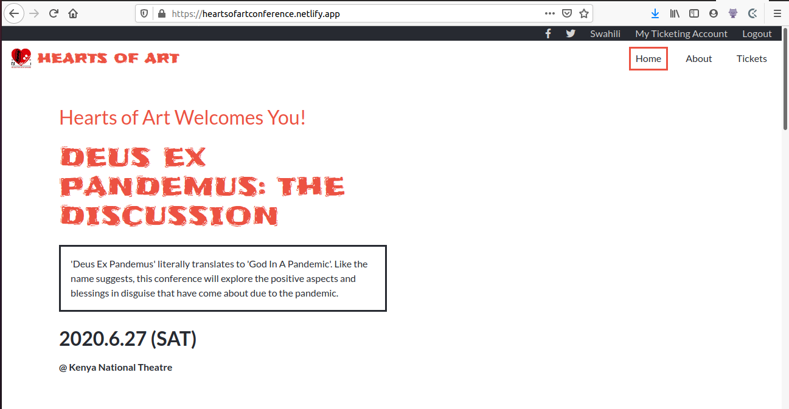

# HTML & CSS Capstone Project

> In this project, I was supposed to take inspiration from [this](https://www.behance.net/gallery/29845175/CC-Global-Summit-2015) demo of a conference site. I decided to build a site announcing an upcoming play and live panel discussion with an interesting title and a rather recognizable theme for anyone checking this project out in 2020. I used Sass to compile the CSS, Bootstrap for most of the responsiveness, and CSS Grid and Flexbox to make some of the more intricate layouts easier. I hope you enjoy what I came up with!

## Built With

- HTML5, CSS3
- Bootstrap,
- SCSS

## Live Demo

[Live Demo Link](https://heartsofartconference.netlify.app/)

## Getting Started

To get a local copy up and running follow these simple example steps.

### Clone the repo

### Install Live Sass on VSCode to read the Sass files

### Install Live Server for fast serving of pages

### Open the files with VSCode, clik on 'Go Live' at the bottom right of the screen and...

### You're good to go! :+1:

## Author

👤 **Ramsey Njire**

- Github: [@Ramsey Njire](https://github.com/RamseyNjire/)
- Twitter: [@untakenramram](https://twitter.com/untakenramram)
- Linkedin: [Ramsey Njire](https://www.linkedin.com/in/ramsey-njire-51984931/)

## 🤝 Contributing

Contributions, issues and feature requests are welcome!

Feel free to check the [issues page](https://github.com/RamseyNjire/HTML-CSS-Capstone-Project/issues).

## Show your support

Give a ⭐️ if you like this project!

## 📝 License

This project is [MIT](https://opensource.org/licenses/MIT) licensed.
